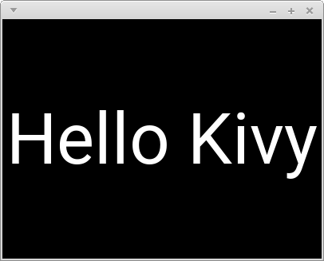
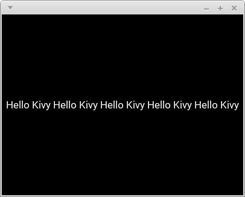
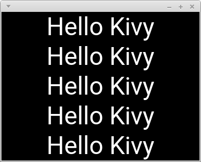
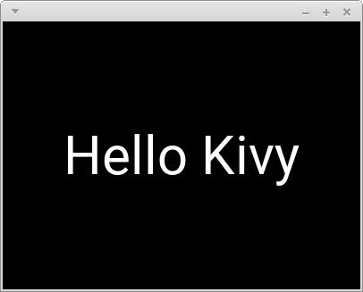
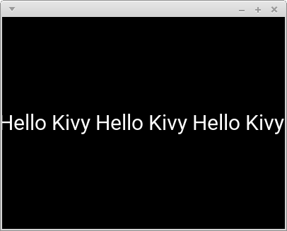
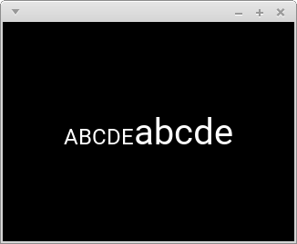

# FontsizeAdjustmentBehavior : Automatically adjust font_size of Label

[日本語doc(jp_doc)](README_jp.md)

## Installation

```
pip install git+https://github.com/gottadiveintopython/fontsize-adjustment-behavior#egg=fontsize_adjustment_behavior
```

## Examples

### short text

```python
from kivy.app import runTouchApp
from kivy.lang import Builder

import fontsize_adjustment_behavior

root = Builder.load_string('''
<MyLabel@FontsizeAdjustmentBehavior+Label>:

MyLabel:
    text: 'Hello Kivy'
''')

runTouchApp(root)
```



### long text

```yaml
MyLabel:
    text: ('Hello Kivy ' * 5)[:-1]
```



### multi line

```yaml
MyLabel:
    text: ('Hello Kivy\\n' * 5)[:-1]
```



### font_size_max

```yaml
MyLabel:
    text: 'Hello Kivy'
    font_size_max: '60sp'
```



### font_size_min

```yaml
MyLabel:
    text: 'Hello Kivy ' * 5
    font_size_min: '30sp'
```



## Note

### Setting font\_size doesn't affect actual font\_size

But listening to its changes is OK.

```python
label = MyLabel()
label.font_size = 40  # doesn't affect actual font_size
label.bind(font_size=some_func)  # OK
```

### about markup

Setting `markup` to True is OK, but setting `text` to an actual markup-text is not, because it hinders the adjustment.

```yaml
MyLabel:
    markup: True
    text: 'ABCDE[size=40]abcde[/size]'
```



### about line\_height and max\_lines

These properties need to be default-value.


## How to test

**WARNING: The tests is extreamly heavy**

```
$ make test
```

Some tests take a screenshot when a test case fails, so that You can visually see what happened.

## Environment

- Python 3.7.1
- Kivy 1.10.1
- SDL2 2.0.4
- SDL2-ttf 2.0.14
