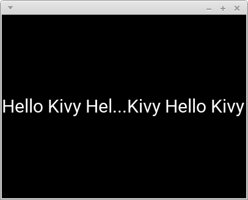
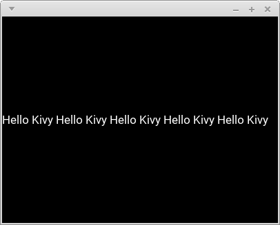
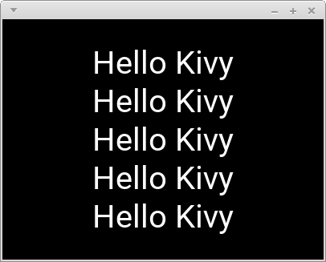
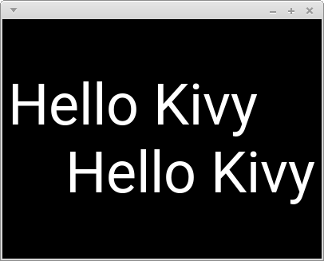
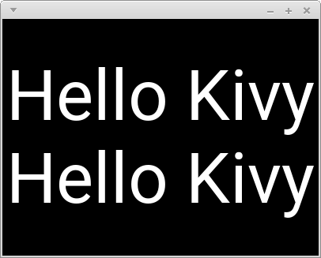
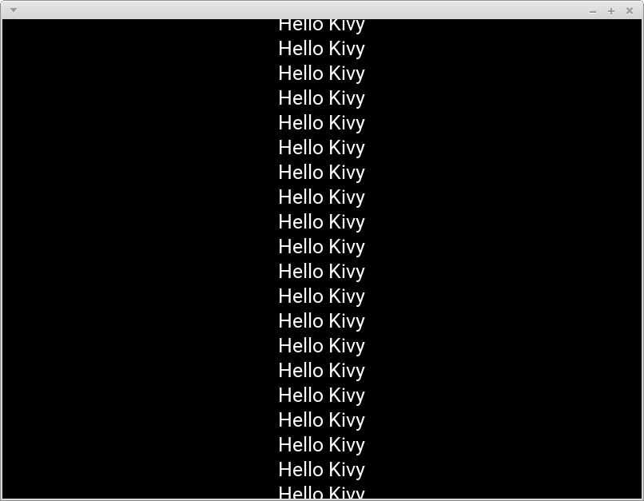
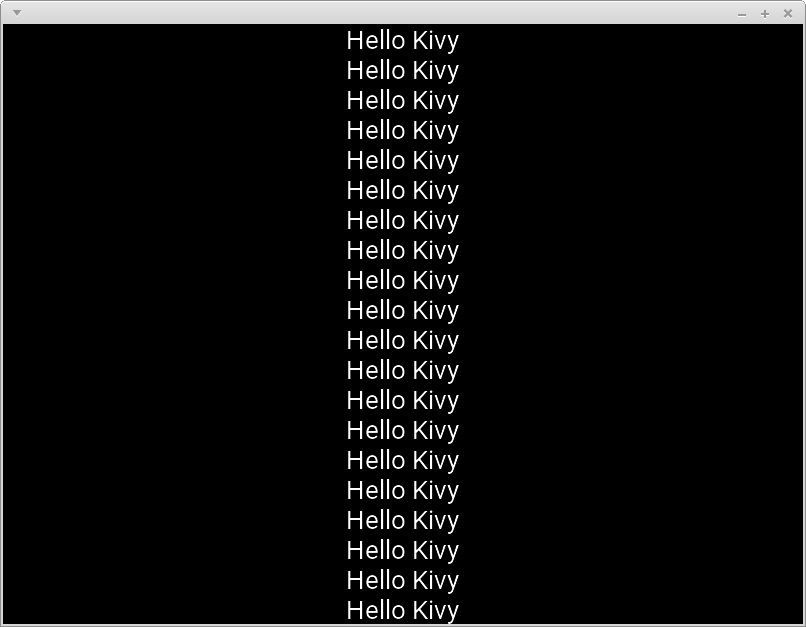

# FlexibleLabel : Automatically adjust font_size

`font_size`を自動調節するLabel

## 例(examples)

### 短い文字列

```python
from kivy.app import runTouchApp
from kivy.lang import Builder

import flexiblelabel


root = Builder.load_string('''
FlexibleLabel:
    text: 'Hello Kivy'
''')

runTouchApp(root)
```


### 長い文字列

```yaml
FlexibleLabel:
    text: ('Hello Kivy ' * 5)[:-1]
```


### 複数行

```yaml
FlexibleLabel:
    text: ('Hello Kivy\\n' * 5)[:-1]
```


### font_sizeの最大値

```yaml
FlexibleLabel:
    text: 'Hello Kivy'
    font_size_max: '60sp'
```


### font_sizeの最小値

```yaml
FlexibleLabel:
    text: 'Hello Kivy ' * 5
    font_size_min: '30sp'
```


### 省略表記

```yaml
FlexibleLabel:
    text: ('Hello Kivy ' * 5)[:-1]
    shorten: True
    text_size: self.width, None
    font_size_min: '30sp'
```



```yaml
FlexibleLabel:
    text: ('Hello Kivy ' * 5)[:-1]
    shorten: True
    text_size: self.width, None
    # font_size_min: '30sp'
```



### 余白

```yaml
FlexibleLabel:
    text: ('Hello Kivy\\n' * 5)[:-1]
    padding_y: '30sp'
```



### 先頭と末尾に空白がある場合(leading and trailing white space)

```yaml
FlexibleLabel:
    text: 'Hello Kivy    \\n    Hello Kivy'
```



### それを取り除いた場合(strip)

```yaml
FlexibleLabel:
    text: 'Hello Kivy    \\n    Hello Kivy'
    strip: True
```




## 失敗例(failure example)

今のところ完璧な調整はできていない。例えば次のコードでは文字列がはみ出してしまっている。

```yaml
FlexibleLabel:
    text: ('Hello Kivy\\n' * 20)[:-1]
```



ただ何故か`text provider`を変える事でうまくいったりもする。

```python
import os
os.environ['KIVY_TEXT'] = 'pil'  # text providerをpilに変更
from kivy.app import runTouchApp
from kivy.lang import Builder

import flexiblelabel


root = Builder.load_string('''
FlexibleLabel:
    text: ('Hello Kivy\\n' * 20)[:-1]
''')

runTouchApp(root)
```



こういった事が起こる原因は全く分かっていない。

## Testに関して

testはtext providerの種類ごとに分けて行う。

```
python -m unittest discover --start-directory ./tests --pattern test_*_on_sdl2.py
python -m unittest discover --start-directory ./tests --pattern test_*_on_pil.py
```

また今の所、`test_sticking_out_on_xxx.py`(文字列がLabelからはみ出ていないかを確かめるtest)は通っていない。

## 他

[Youtube](https://youtu.be/HhxQW7ZFon4)

#### 環境
- Python 3.6.3
- Kivy 1.10.1
- SDL2 2.0.4
- SDL2-ttf 2.0.14
- pillow 5.3.0
