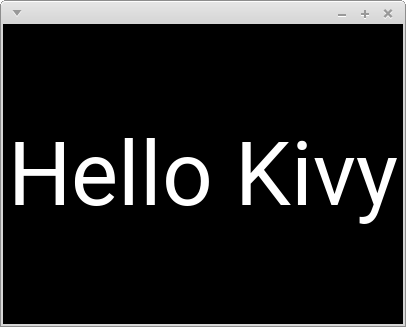
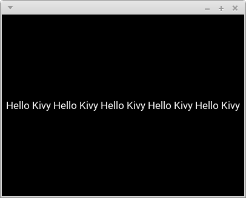
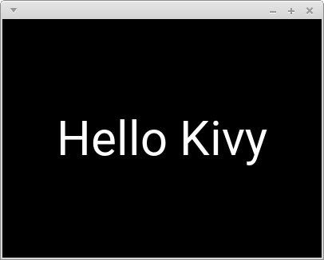
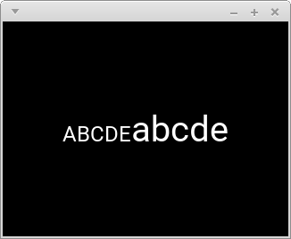

# FontsizeAdjustmentBehavior : Labelのfont\_sizeの自動調節

## Install方法

```
pip install git+https://github.com/gottadiveintopython/fontsize-adjustment-behavior#egg=fontsize_adjustment_behavior
```

## 使用例

### 短い文字列

```python
from kivy.app import runTouchApp
from kivy.lang import Builder

import fontsizeadjustmentbehavior

root = Builder.load_string('''
<MyLabel@FontsizeAdjustmentBehavior+Label>:

MyLabel:
    text: 'Hello Kivy'
''')

runTouchApp(root)
```



### 長い文字列

```yaml
MyLabel:
    text: ('Hello Kivy ' * 5)[:-1]
```



### 複数行

```yaml
MyLabel:
    text: ('Hello Kivy\\n' * 5)[:-1]
```


### font\_sizeの上限

```yaml
MyLabel:
    text: 'Hello Kivy'
    font_size_max: '60sp'
```



### font\_sizeの下限

```yaml
MyLabel:
    text: 'Hello Kivy ' * 5
    font_size_min: '30sp'
```


## 注意点

### font\_sizeに書き込んでも実際の文字の大きさは変わりません

`font_size`の調節は全てこのmoduleが担うのでuserが直接変更することはできません。ただ`bind()`を用いて変更を監視することはできます。

```python
label = MyLabel()
label.font_size = 40  # 意味なし
label.bind(font_size=some_func)  # OK
```

### markupに関して

`markup`を`True`にしても大丈夫ですが、`text`に実際に`markup text`を入れると自動調節に失敗します。

```yaml
MyLabel:
    markup: True
    text: 'ABCDE[size=40]abcde[/size]'
```



### line\_height と max\_lines に関して

これらのproeprtyは既定値のままである必要があります。

## Testの仕方

**注意: Testは非常に重たいです**

```
$ make test
```

testの中には失敗した時にその時のLabelの状態を画像に保存するものもあります。失敗の原因を探る手がかりとして活かしてください。

## 環境

- Python 3.7.1
- Kivy 1.10.1
- SDL2 2.0.4
- SDL2-ttf 2.0.14
